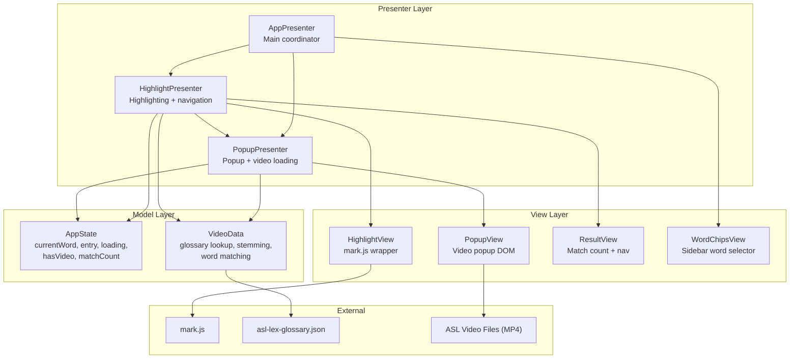
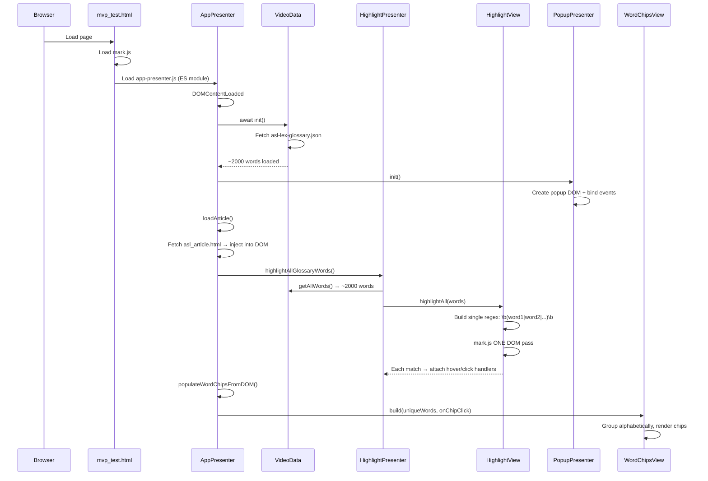
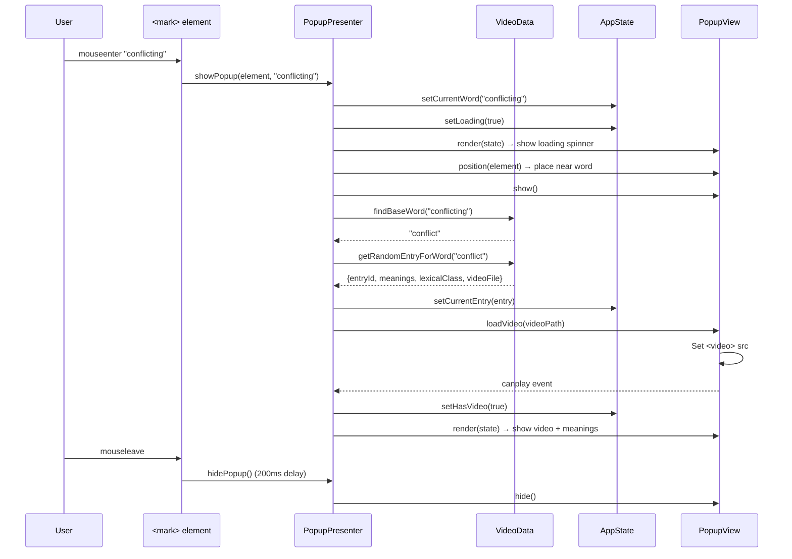
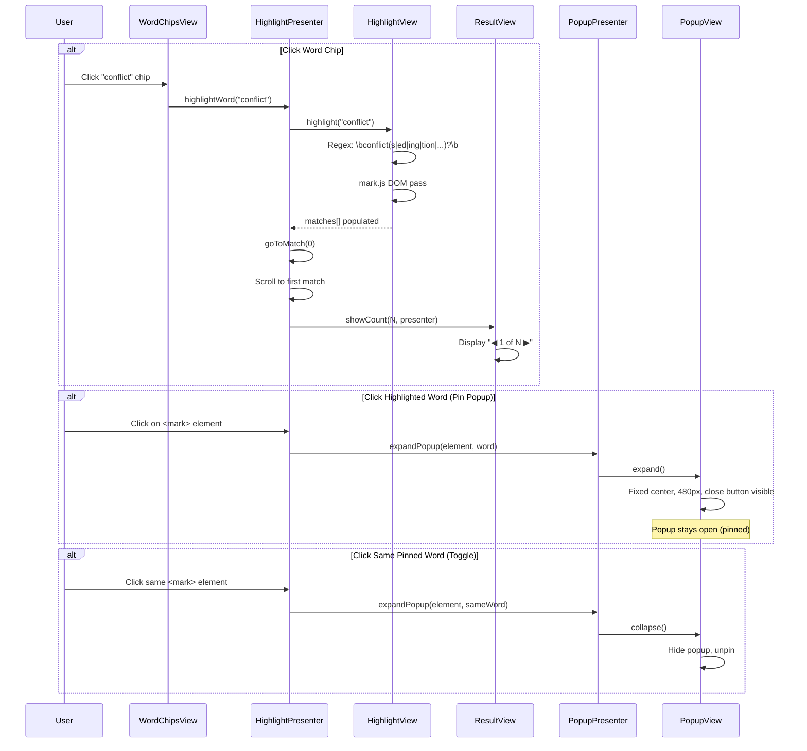
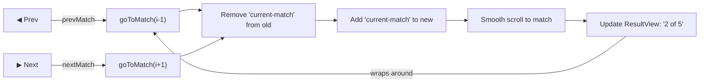
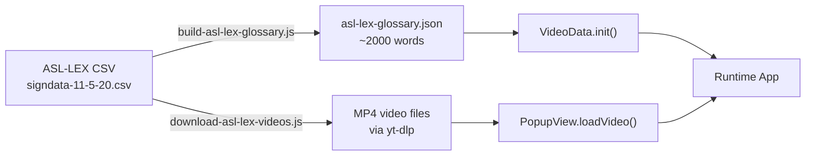

# ASL Demo - Architecture & Flow Diagrams

## Architecture Overview (MVP Pattern)

## Application Startup Flow

## Hover Interaction Flow

## Click to Pin / Word Chip Flow

## Match Navigation

## Data Pipeline (Build Phase)

## Key Design Decisions

- **Single DOM pass**: All ~2000 glossary words are combined into one regex and matched in a single `mark.js` traversal, avoiding per-word loops that would freeze the page.
- **Smart stemming**: Suffix stripping (ing, ed, tion, ly, etc.) with doubled-consonant handling maps inflected forms back to base glossary words.
- **Short word protection**: Words 1-3 characters long match exactly only, preventing false positives like "on" matching "only".
- **Pinned popup state**: Click pins the popup open so users can read definitions while scrolling; hover alone is transient with a 200ms hide delay.
