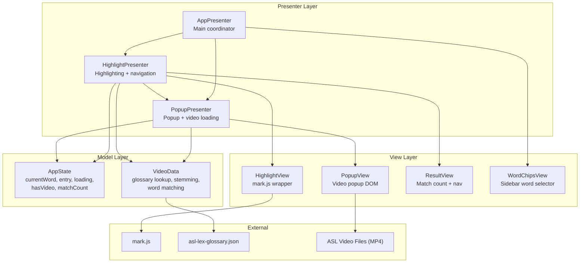
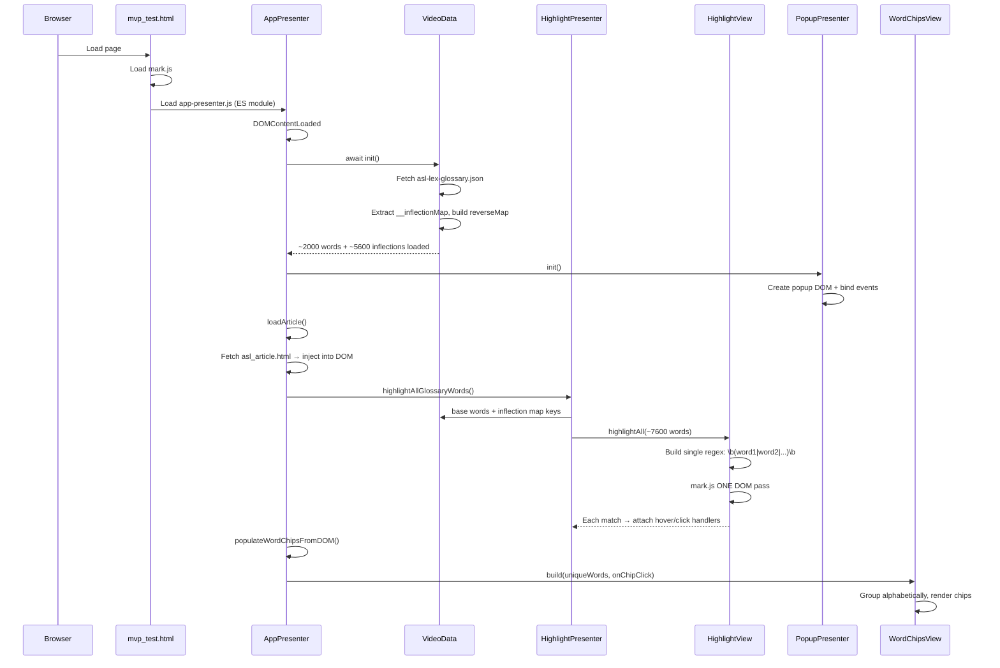
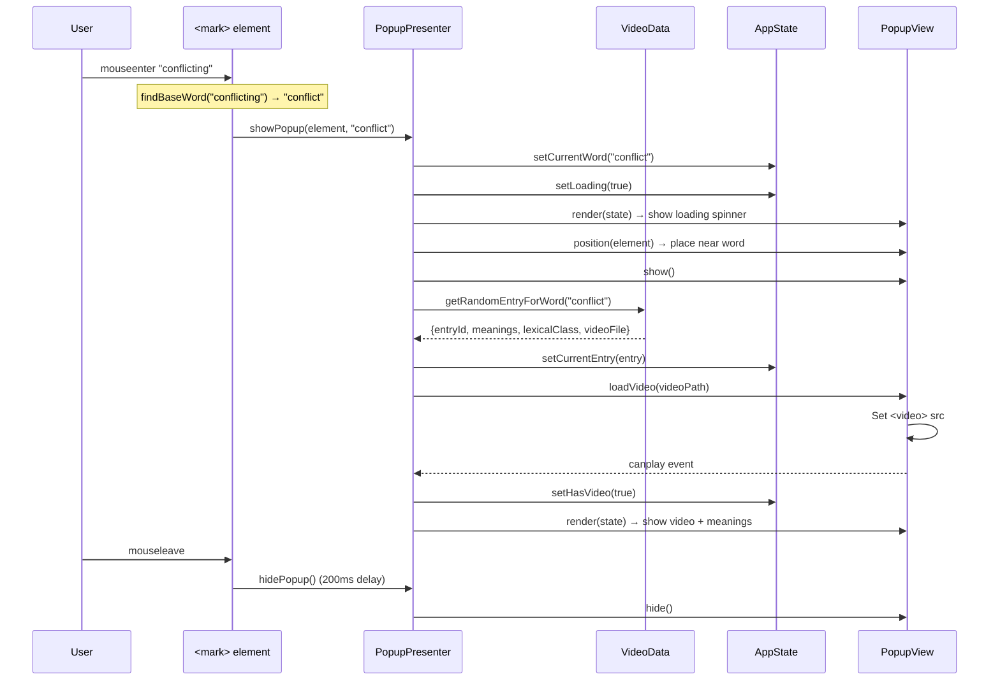
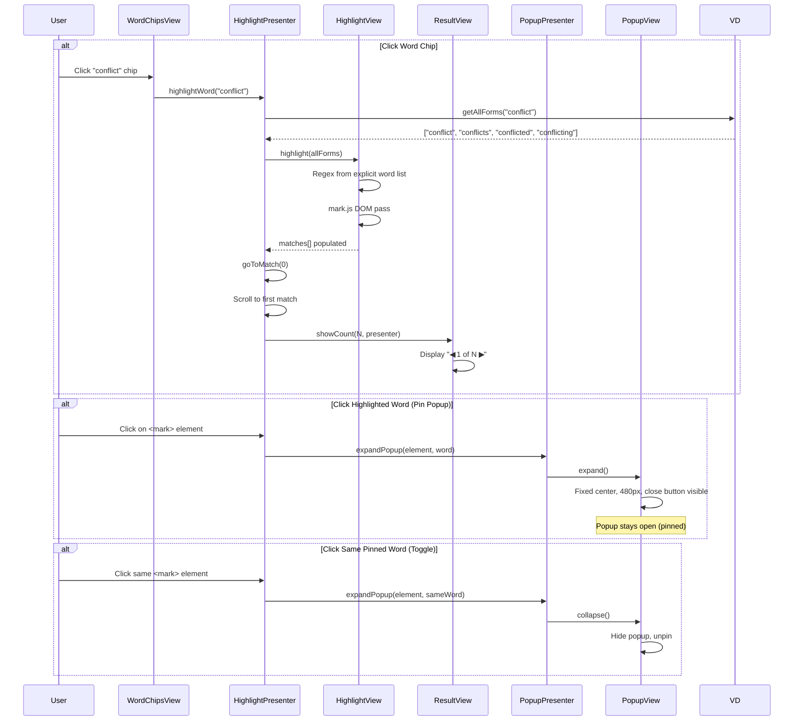
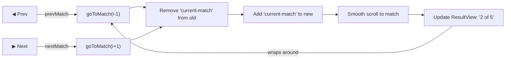
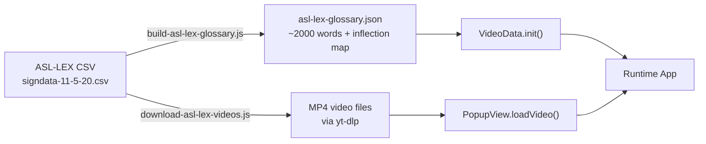

# ASL Demo - Architecture & Flow Diagrams

## Architecture Overview (MVP Pattern)



## Application Startup Flow



## Hover Interaction Flow



## Click to Pin / Word Chip Flow



## Match Navigation



## Data Pipeline (Build Phase)



## Key Design Decisions

- **Single DOM pass**: All ~2000 glossary words are combined into one regex and matched in a single `mark.js` traversal, avoiding per-word loops that would freeze the page.
- **Pre-computed inflection map**: The build script generates an `__inflectionMap` (inflected form → base word) embedded in the glossary JSON. At runtime, `findBaseWord()` is two hash lookups — no suffix stripping, no false positives. Handles regular inflections, consonant doubling, ie→ying, irregular forms (ran→run, children→child), and deliberately excludes agent nouns (-er/-ers) since those are different ASL signs.
- **Base word display**: Popup always shows the dictionary form (e.g., "accept" not "accepted") since ASL signs don't inflect for tense — the same sign covers all English forms.
- **Pinned popup state**: Click pins the popup open so users can read definitions while scrolling; hover alone is transient with a 200ms hide delay.

## Future Considerations

### Decouple Presenters

HighlightPresenter directly calls PopupPresenter (`showPopup`, `expandPopup`). Replace with an event-based approach so they communicate without knowing about each other. This makes each presenter independently testable and swappable (e.g., replace popup with a sidebar panel).

### ~~Pre-computed Stemming Map~~ (Done)

Implemented. The build script (`build-asl-lex-glossary.js`) now generates an `__inflectionMap` with ~5,600 entries covering regular inflections (noun plurals, verb conjugations, adjective forms), ~80 irregular forms, and consonant doubling. Agent nouns (-er/-ers) are excluded. `VideoData.findBaseWord()` is now a simple map lookup. `getWordsInText()` tokenizes and does O(1) lookups per word instead of scanning 2000+ regexes.

### Accessibility

- Add `role="button"` and `aria-label` on highlighted `<mark>` elements
- Add `aria-live` region for the popup so screen readers announce content changes
- Implement keyboard navigation: Tab into popup, Escape to close, arrow keys for match navigation

### Testing Strategy

#### Current State

Only `VideoData` has tests (45 assertions in `video-data.test.js`, custom runner, runs in Node.js). All presenters and views are untested. That's roughly 4% coverage by module count.

#### Testing Layers

The MVP architecture naturally maps to three testing layers, each serving a different purpose:

**1. Unit Tests — Model Layer (Node.js, no DOM)**

Pure data logic. No browser needed. Fast to run, easy to write.

| Module | What to test | Priority |
|--------|-------------|----------|
| `VideoData` | `findBaseWord`, `getAllForms`, `getWordsInText`, inflection map lookup, collision handling | ✅ Done |
| `AppState` | Setter/getter correctness, `reset()` clears all fields, state never leaks between calls | Low — trivial setters, but useful as a regression guard |

**2. Integration Tests — Presenter Layer (Node.js with mocked Views)**

This is the highest-value untested layer. Presenters contain all the coordination logic — state transitions, event sequencing, error handling — but they don't touch the DOM directly. Mock the views and test the presenter logic in isolation.

| Module | Critical logic to test |
|--------|----------------------|
| `HighlightPresenter` | Match navigation wraps around correctly (index 0 → N-1 → 0). `highlightWord()` resets previous matches before starting new ones. `highlightAllGlossaryWords()` passes both base words and inflected forms. `clearHighlights()` resets state and delegates to view. |
| `PopupPresenter` | Pin/unpin toggle: click same word twice collapses. Hover while pinned does not override pinned popup. 200ms hide delay cancels if mouse re-enters. Video load error updates state to `hasVideo: false`. `showPopup` resolves base word before loading entry. |
| `AppPresenter` | Init sequence: VideoData → PopupPresenter → loadArticle → highlight → word chips. `handleClear()` delegates to HighlightPresenter. |

**How to mock**: Each view is a plain object with methods. Create stub objects that record calls:

```js
const mockHighlightView = {
    highlightAllCalls: [],
    highlightAll(words, onEach) {
        this.highlightAllCalls.push({ words });
        // simulate matches by calling onEach with fake elements
    },
    clear(cb) { cb(); }
};
```

This layer catches the bugs that matter most — wrong navigation state, popup stuck open, events firing in the wrong order — without needing a browser.

**3. E2E Tests — Full Browser (Playwright)**

Real browser, real DOM, real mark.js. This is where you verify that the pieces actually work together and is essential for browser extension readiness since extensions run on unpredictable third-party pages.

| Flow | What to verify |
|------|---------------|
| **Page load** | Article loads, `<mark>` elements appear in DOM, sidebar populates with word chips |
| **Hover → popup** | Hover on highlighted word → popup appears with video, correct base word displayed (not inflected form), popup disappears after mouse leaves |
| **Click → pin** | Click highlighted word → popup pins in center, click again → popup collapses |
| **Word chip → navigate** | Click chip → matches highlighted, "1 of N" counter shown, prev/next buttons cycle through matches, scroll position changes |
| **Search** | Type in search box → chips filter, clear search → all chips return |
| **Inflections** | Hover on "accepted" → popup shows "accept", hover on "running" → popup shows "run" |
| **Edge cases** | Short words don't false-match inside longer words ("art" doesn't match inside "article"). Words at start/end of sentences still highlight. |

**Why Playwright over Cypress**: Playwright supports browser extension testing natively via `chromium.launchPersistentContext()` with the `--load-extension` flag. When this becomes an extension, the same E2E suite tests it on real web pages.

#### What NOT to Unit Test

**Views** (`HighlightView`, `PopupView`, `ResultView`, `WordChipsView`) are thin DOM wrappers. Testing them in isolation requires JSDOM or a real browser, and the tests end up mirroring the implementation ("did you call `classList.add`?"). They get covered naturally by E2E tests. The exception is `PopupView.position()` — the positioning math (above/below target, minimum margins) could be extracted into a pure function and unit tested.

#### Test Pyramid for This Project

```
        /  E2E  \          ← 5-10 tests, Playwright, slow but high confidence
       /----------\
      / Integration \       ← 20-30 tests, mocked views, catches coordination bugs
     /----------------\
    /    Unit (Models)   \  ← 50+ assertions, Node.js, fast, catches data bugs
   /----------------------\
```

#### Tooling Recommendations

| Tool | Purpose | Why |
|------|---------|-----|
| **Vitest** | Test runner + assertions | Fast, ES module native (matches current codebase), built-in mocking. Jest works too but requires more config for ES modules. |
| **Playwright** | E2E browser tests | Extension testing support, multi-browser, good async handling |
| **c8 / v8 coverage** | Code coverage | Built into Vitest, shows which presenter branches are untested |

#### Priority Order

1. **Presenter integration tests** — highest value, catches the most dangerous bugs (stuck states, wrong navigation, popup not closing)
2. **E2E happy paths** — verifies the full stack works in a real browser
3. **AppState unit tests** — quick to write, low risk
4. **E2E edge cases** — inflections, short words, rapid hover
5. **Build script tests** — verify inflection generation rules produce expected output

### Video Loading

Every hover triggers a video load. Quick hovers across multiple words start and abort loads repeatedly. An LRU cache (5-10 entries) for loaded video blobs would make re-hovers instant and reduce network churn.

### Browser Extension Readiness

- Content script entry point that highlights existing page content instead of fetching/injecting an article
- CSP handling for mark.js injection and inline styles
- Scoped highlighting that doesn't conflict with site markup
